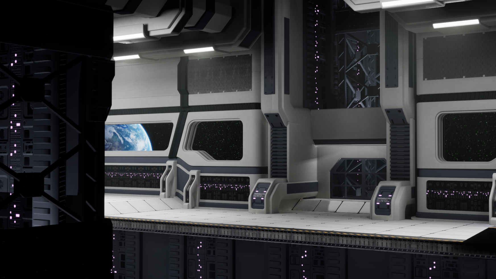

# Coursework for "Creating Advanced Trim Sheet Textures for Games"

This contains the projects used for the course [Creating Advanced Trim Sheet Textures for Games](https://www.artstation.com/marketplace/p/2dAgp/creating-advanced-trim-sheet-textures-for-games-in-depth-tutorial-course).

The course was completed but then the Substance Painter file was corrupted and thus had to revert to an earlier version of the scene. The earlier version missed the railing, crates and final polish. The alternative was to redo the work which seemed less ideal.

<table width="100%">
<tbody>
<tr>
<td>
<figure>
<figcaption>Final Render</figcaption>

</figure>
</td>
</tr>
</tbody>
</table>
